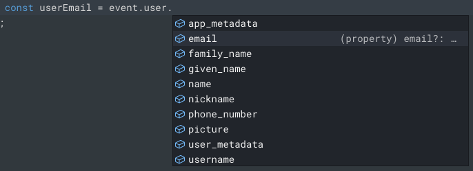

# Challenge 01: Prevent fraudulent sign-ups

> **Scenario**: Your team is seeing a high volume of free sign-ups using email burner domains (like @mailinator.com). These sign ups are associated with account abuse and are also increasing your costs on infrastructure and mail marketing.

**Your task**: Build an action to block sign-ups from email burners!

## Initial clues

- You need to validate the emai before the user registration (pre-user registration).
- The [liburner-email-providers](https://www.google.com/url?q=https://www.npmjs.com/package/burner-email-providers&sa=D&source=editors&ust=1715877455182162&usg=AOvVaw1ZR-d8m2DSfZXwQuRNjzYy) library can validate email burners in one line:
- The actions console has "intellisense" and auto-complete built-in.
- You can use the dependencies menu to add npm libraries:

### Tip 1: Create a pre user registration action

1. From the Auth0 Dashboard, go to Actions > Library
2. Click Create Action > Build from Scratch.
3. Enter the following:

   - Name: email-burner-verification
   - Trigger: Pre User Registration
   - Runtime: Node 18 (recommended)

     

4. Click Create.

### Tip 2: A boilerplate (expand to reveal):

```javascript
const { isEmailBurner } = require("burner-email-providers");

exports.onExecutePreUserRegistration = async (event, api) => {
  //TODO: Add validation logic to emailBurner
  const emailBurner = isEmailBurner("example@mailinator.com");
  if (emailBurner) {
    //TODO: throw error
    const internalError = "internal error";
    const externalError = "external error";
    api.access.deny(internalError, externalError);
  }
};
```

### Tip 3: How to get the user email (expand to reveal):

```javascript
console.log(event.user.email);
```

### Tip 4: How to implement an elegant error handling (expand to reveal):

```javascript
const internalError = "Mail Burner: "+event.user.email;

const externalError = event.user.email.split('@')[1]+" is an email burner 🔥. Please sign up with a valid email address";
```

### Tip 5: How to unit test your Action before deploy (expand to reveal):

1. On the left menu, click the test functionality (play icon);
1. Click Run. You should get an error (the email domain used in the tests: "j+smith@example.com", is considered a burner).  
   
1. In the test json, change the email to @gmail.com and test again  
   
1. The test will run without errors.

### Solution: (expand to reveal)

Create a custom action:

1. From the Auth0 Dashboard, go to Actions > Library
1. Click Create Action > Build from Scratch.
1. Enter the following:

1. Name: email-burner-verification

   - Trigger: Pre User Registration
   - Runtime: Node 18 (recommended)

1. Click Create.

Import the burner-email-providers library:

1. On the left-hand side, Click Dependencies, then Add Dependency.
1. Enter burner-email-providers as the name and click Create.
1. Add the code:

   ```javascript
   const { isEmailBurner } = require("burner-email-providers");

   exports.onExecutePreUserRegistration = async (event, api) => {
     const emailBurner = isEmailBurner(event.user.email);
     if (emailBurner) {
       const internalError = "Mail Burner: " + event.user.email;
       const externalError =
         event.user.email.split("@")[1] +
         " is an email burner 🔥. Please sign up with a valid email address";
       api.access.deny(internalError, externalError);
     }
   };
   ```

## Deploy and test your solution

1. Click Deploy
1. On the left menu, click Actions > Flows.
1. Click Pre User Registration
1. Click Custom
1. Drag and drop your action to the flow.
1. Click Apply

Test a sign up from your app:

1. Navigate to your application.
1. If already logged in, click the user profile (top right corner) > Logout.
1. Click Login and then Sign Up
1. Sign up with the email: [whatever@mailinator.com](mailto:whatever@mailinator.com)
1. Confirm that the user creation got blocked.

   

Test a sign up from the Auth0 dashboard:

1. Return to a tab with the Auth0 dashboard
1. Click User Management > Users.
1. Click Create User.
1. Create a user with the email: [whatever@mailinator.com](mailto:whatever@mailinator.com)
1. Confirm that the user creation got blocked.

   

## Congratulations

You have completed our challenge 01 by blocking fraudulent sign-ups from mail burners! Read below why this is a great skill to have and try our next challenge (notify VIP sign-ups)

**In real life**

Fraudulent sign-ups are a big challenge for digital businesses. A report by Juniper Research estimates that fraudulent sign-ups cost businesses approx $2 trillion in 2023. Attackers have different incentives to create fake accounts, from scalping limited items — like tickets and products, to taking financial advantage of free offerings — i.e. discounts, to using free service accounts to carry over security attacks. Fake accounts also pollute your user data, making it difficult for your business to understand your genuine customer base.
