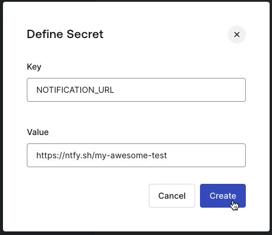
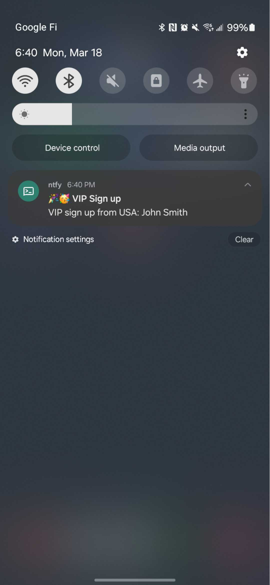
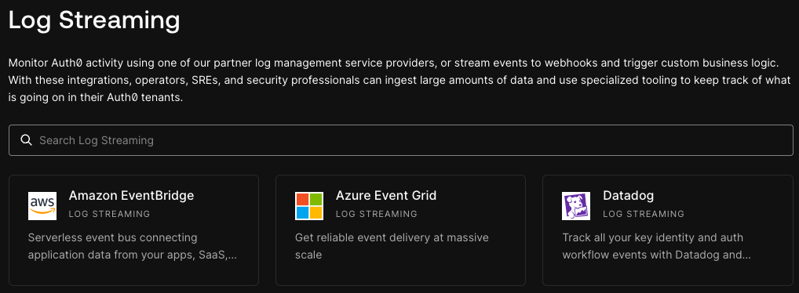
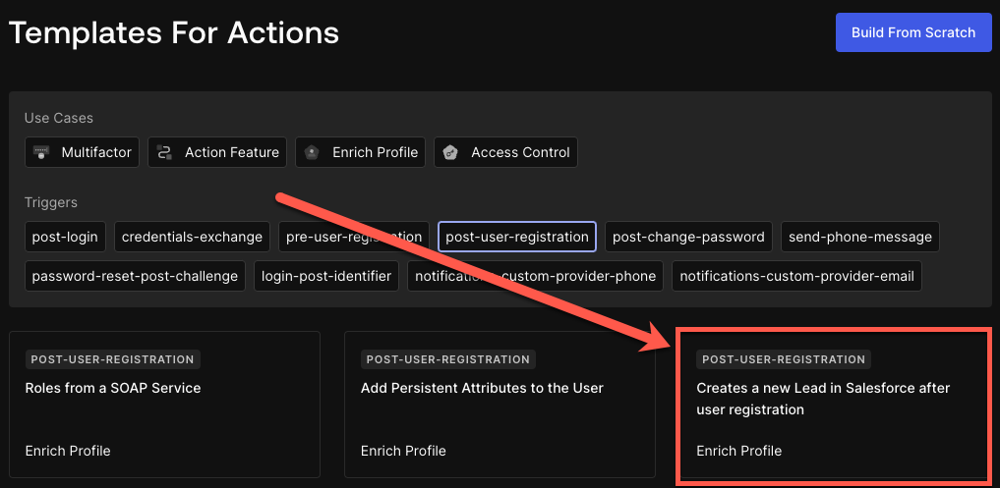

# Challenge 02: Notify VIP sign-ups

> **Scenario**: Your sales team wants to be on top of VIP sign-ups. Whenever a person of interest (from specific countries) signs-up, they want to receive a notification so they can timely reach out to and offer VIP support.

**Your task**: Build an action to send a notification whenever a customer from VIP countries signs up to your platform.

## Requirement

For this lab, you will use [https://ntfy.sh/](https://www.google.com/url?q=https://ntfy.sh/&sa=D&source=editors&ust=1715877455198509&usg=AOvVaw3p1QrpJs-sQXXD5oThELYD), a lightweight pub-sub service to send notifications to your cell phone or your own computer.

### To use ntfy.sh from your phone

1. From your phone, visit [https://ntfy.sh](https://www.google.com/url?q=https://ntfy.sh&sa=D&source=editors&ust=1715877455198960&usg=AOvVaw2kvIPRBpboRDidxgoLGhTi)
1. Select and download the app for Android or Apple.
1. After download, launch the app from your phone
1. Click subscribe to topic
1. Enter a unique topic name (i.e. awesome-test)
1. Record the url for notification (i.e. [https://ntfy.sh/my-awesome-test](https://www.google.com/url?q=https://ntfy.sh/my-awesome-test&sa=D&source=editors&ust=1715877455199430&usg=AOvVaw1-YoyDRkUcxOipH355hoBN))

### (alternative) To use ntfy.sh from your computer

1. Go to [https://ntfy.sh/app](https://www.google.com/url?q=https://ntfy.sh/app&sa=D&source=editors&ust=1715877455199760&usg=AOvVaw3USxLPJsNB-h_7MCpZxXEC) 
1. Click Subscribe to a topic.
1. Enter a unique topic name or click generate name, and then click subscribe:
1. Record the url for notification (i.e. [https://ntfy.sh/my-awesome-test](https://www.google.com/url?q=https://ntfy.sh/my-awesome-test&sa=D&source=editors&ust=1715877455200146&usg=AOvVaw0YPnatybyOtlxrPkZxxEpW))  
    

## Initial tips

* Your action will run after a user sign up (post sign up)
* ntfy.sh accepts POST requests as follows. Try and confirm:

    ```bash
    curl -d "Hello World 😀" ntfy.sh/mytopic
    ```

* You can use the [axios](https://www.google.com/url?q=https://www.npmjs.com/package/axios&sa=D&source=editors&ust=1715877455201216&usg=AOvVaw1DmdkTEchgeO9T1e7gXt-y) library to make REST API calls. You can import the library the same way you did in previous challenges.

### Tip 1: A boilerplate (expand to reveal):

```javascript
// TODO: Add your country to the VIP list
const vipCountries = \["USA", "BRA", "GER", "JPN"\]

exports.onExecutePostUserRegistration = async (event, api) => {
 // TODO: Replace COUNTRY with the sign up country
 if(vipCountries.includes(COUNTRY)){
   // TODO: provide notification url
   const notificationUrl = event.secrets.NOTIFICATION_URL;
   const headers = {
     'Title': 'VIP Sign up',
     'Priority': 'urgent',
     'Tags': 'tada,partying_face'
   };
   const body = `VIP sign up from ${COUNTRY}: ${EMAIL}`;

   // TODO: Make a request with the url, request, and body above
   return;
 }

};
```

**Important**: Expand the list of VIP countries with your country ([3 letters](https://www.google.com/url?q=https://en.wikipedia.org/wiki/ISO_3166-1_alpha-3&sa=D&source=editors&ust=1715877455207548&usg=AOvVaw2tBoso5pvShoR76Yx4K92j)). Example, for Italy:

```javascript
// TODO: Add your country to the VIP list
const vipCountries = \["USA", "BRA", "GER", "JPN", "ITA"\]
```

### Tip 2: How do I use an app secret to store the NOTIFICATION_URL? (expand to reveal):

Create secrets:

1. On the left-hand side, click the Secrets (key icon), then Add Secret.
    - Create the secret NOTIFICATION_URL and add your notification url from ntfy.sh as value.
    - The secret will be available in the event.secrets.NOTIFICATION_URL variable.

### Tip 3: How to get user information? (expand to reveal):

```javascript
//COUNTRY
console.log(event.request.geoip.countryCode3);

//EMAIL
console.log(event.user.email);
```

### Tip 4: How do I use axios? (expand to reveal):

1. On the left-hand side, click Dependencies, then Add Dependency.
1. Enter axios as the name and click Create.
1. In your code, import axios on line 1

    ```javascript
    const axios = require("axios");
    ```

1. Use axios.post to send a request to your notification service:

    ```javascript
    // TODO: Make a request with the url, request, and body above
    await axios.post(notificationUrl, body, { headers });
    ```

### Tip 5: How to unit test your Action before deploy (expand to reveal):

1. On the left menu, click the test functionality (play icon);
1. Click Run. You should get a successful run (no errors reported).
1. Check ntfy.sh to confirm you got a notification

### Solution: (expand to reveal)

Create a custom action:

1. From the Auth0 Dashboard, go to Actions > Library
1. Click Create Action > Build from Scratch.
1. Enter the following:
    - **Name**: post-signup-notification
    - **Trigger**: Post User Registration
    - **Runtime**: Node 18 (recommended)

1. Click Create.

Import the axios library:

1. On the left-hand side, click Dependencies, then Add Dependency.
1. Enter axios as the name and click Create.

Create secrets:

1. On the left-hand side, click the Secrets (key icon), then Add Secret.
1. Create the secret NOTIFICATION_URL and add your notification url (with https://) from ntfy.sh as value.

    

1. Add the code:

    ```javascript
    const axios = require("axios");
    const vipCountries = \["USA", "BRA", "GER", "JPN"\]

    exports.onExecutePostUserRegistration = async (event, api) => {
    if(vipCountries.includes(event.request.geoip.countryCode3)){
      const notificationUrl = event.secrets.NOTIFICATION_URL;
      const headers = {
        'Title': 'VIP Sign up',
        'Priority': 'urgent',
        'Tags': 'tada,partying_face'
      };
      const body = `VIP sign up from ${event.request.geoip.countryCode3}: ${event.user.email}`;
      await axios.post(notificationUrl, body, { headers });
      return;
    }
    };
    ```

## Deploy and test your solution

1. Click Deploy
1. On the left menu, click Actions > Flows.
1. Click Post User Registration
1. Click Custom
1. Drag and drop your action to the flow.
1. Click Apply

Test a sign up from your app:

1. Navigate to your application
1. If already logged in, sign out.
1. Click Login and then Sign Up.
1. Sign up with a new account
1. In ntfy.sh, confirm that you see your VIP notification:

    

## Congratulations

Now you know how to trigger notifications post sign-ups (and also added ntfy.sh to your toolset)! Under **in real life, learn about when to use Auth0 Actions for notifications (and **when to use other methods like log streaming), and then try our first post login challenge!

**In real life:**

User sign-ups are considered a trigger event for digital businesses and apps:

* For sales and marketing, user sign-up triggers a change in strategy, from engaging with a user without contact information (i.e. ads), to new channels like email and product UI.
* For security, a high risk sign-up can trigger further investigation for sign up fraud.

Auth0 provides two ways to ship events to third party systems:

* [Log Streams](https://www.google.com/url?q=https://auth0.com/docs/customize/log-streams&sa=D&source=editors&ust=1715877455229608&usg=AOvVaw0TJGKJ9veOJdKpoaTnEVd6) allows you to send Auth0 tenant log events near real time to observability, SIEM, and CDP/product analytics systems like AWS event bridge, Datadog, Splunk, and Twilio Segment. These systems are built from the ground up to process, parse, and filter events in large volume and with Auth0-defined payloads.
* With Actions, you can notify and keep third-party systems in sync with important identity events (similarly to how you've triggered ntfy.sh). This pattern is applicable to systems that receive notifications via APIs at a lower volume, only for specific events, and with an opinionated API interface. The actions templates and the Auth0 marketplace have pre-built logic and integrations for popular use-cases:  
      
    

