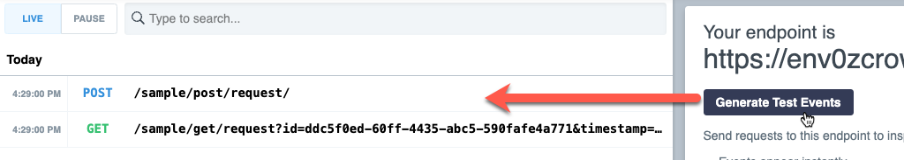
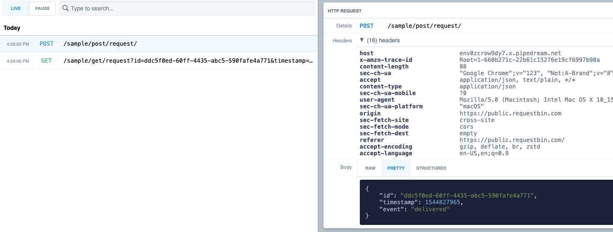
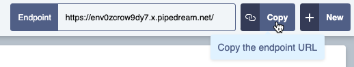
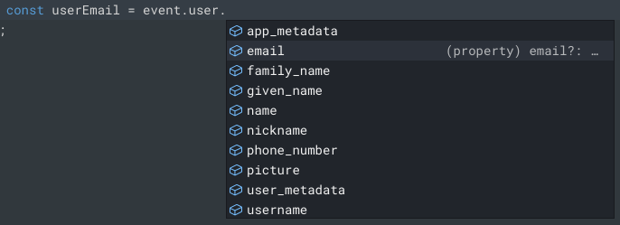
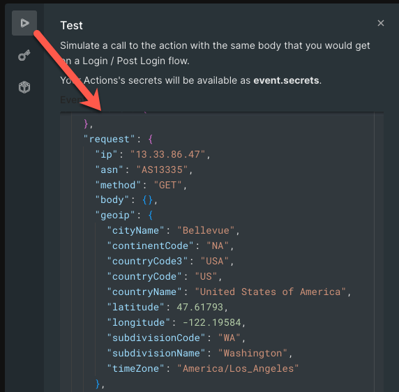
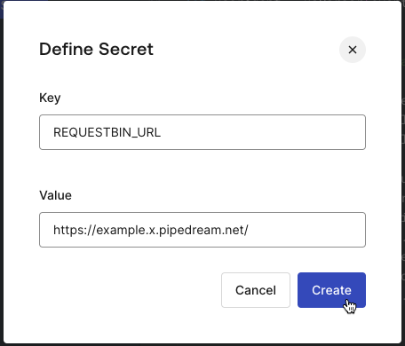
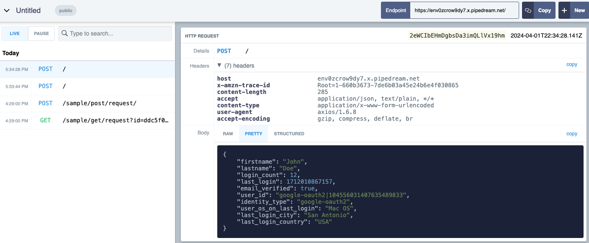

# Challenge 03: Sync Auth0 and a data lake via REST API

> **Scenario**: Your data science team wants you to send as much contextual information about the user login as possible for their data lake. Their goal is to use the data for marketing analysis, personalization, and to discover how to better interact with your user. Currently, users are created only in Auth0, with no data shared with the data lake.

**Your task**: Build an action to send user id, information, and context to the data lake.

## Requirement

To emulate a data lake REST endpoint — and inspect REST API requests, you will use RequestBin. A mock service for REST API and webhook inspection. To configure RequestBin:

1. Visit [https://public.requestbin.com/r](https://www.google.com/url?q=https://public.requestbin.com/r&sa=D&source=editors&ust=1715877455232275&usg=AOvVaw1w0vQdjcSJOzuCn8fLYfXu) 
1. You will be assigned a random endpoint url (displayed in the top right corner).
1. Click generate test events and see how request bin displays request information in real time on the left panel:

    

1. Observe one of the requests.

    

1. The header section displays the request headers.
1. The body section displays the body content of your request in multiple formats, including pretty:
1. Click copy (top right hand corner) to copy your url.

    

This value will be used in your action code.

## Initial tips

* You can use the [axios](https://www.google.com/url?q=https://www.npmjs.com/package/axios&sa=D&source=editors&ust=1715877455233840&usg=AOvVaw0qW3mTQCI9KN50acw5Q_kn) library to make REST API calls. Like you did in previous challenges.
* You can use the [ua-parser-js](https://www.google.com/url?q=https://www.npmjs.com/package/ua-parser-js&sa=D&source=editors&ust=1715877455234290&usg=AOvVaw1YJpYUEtE-0t57UbWp6N79) library to find out the user device from their http header information.
* Use the learnings from previous challenges to set secrets, import libraries, and access user info from the event object.
* For the datalake, we will want to pass three types of information:

* User id in Auth0
* Basic user information (profile data)
* Contextual information (such as the geo location and the operating system a user logged in from, obtained through the user IP origin and device header)

### Tip 1: A boilerplate (expand to reveal):

```javascript
const axios = require("axios");
const uaParser = require("ua-parser-js");

exports.onExecutePostLogin = async (event, api) => {
 // TODO: Set the REQUESTBIN_URL secret
 const url = event.secrets.REQUESTBIN_URL;

 // TODO Replace ??? with the user agent string from the http header
 let userAgent = uaParser(???);

 // TODO Replace ??? with the appropriate user data provided by Auth0
 const data = {
   'firstname': "???",
   'lastname': "???",
   'login_count': "???",
   'last_login': "???",
   'phone': "???",
   'email_verified': "???",
   'user_id': "???",
   'identity_type': "???",
   'user_os_on_last_login': "???",
   'last_login_city': "???",
   'last_login_country': "???"
 };

 try{
   await axios.post(url, JSON.stringify(data));
 }catch(error){
   //If the data lake throws an error, log but don't block user access
   console.error(error.message);
   return;
 }
};
```

### Tip 2: What information can I access from auth0?

There are 3 ways you can find that:

1. The actions editor has "intellisense" and auto-complete built-in.
1. The test tab shows an example of event payload with the data you should expect  
    
1. The [Auth0 documentation](https://www.google.com/url?q=https://auth0.com/docs/customize/actions/flows-and-triggers/login-flow/event-object&sa=D&source=editors&ust=1715877455244929&usg=AOvVaw2XiJy0RvgBamW70olvoDGN) provides detailed information about the actions event, including which data to expect.

### Tip 3: How do I find the user device OS using ua-parser?:

```javascript
let userAgent = uaParser(event.request.user_agent);

console.log(userAgent.os.name);

// Other examples on https://uaparser.js.org/
// console.log(userAgent.browser.name);
// console.log(userAgent.browser.version);
// console.log(userAgent.os.version);
// console.log(userAgent.device.type);
// console.log(userAgent.device.brand);
// console.log(userAgent.device.model);
// console.log(userAgent.device.is_mobile);
// console.log(userAgent.device.is_tablet);
// console.log(userAgent.device.is_desktop);
// console.log(userAgent.device.is_smarttv);
// console.log(userAgent.device.is_bot);
// console.log(userAgent.device.is_feed_reader);
```

### Tip 4: How to get user information? (expand to reveal):

```javascript
console.log('firstname': event.user.given_name)
console.log('lastname': event.user.family_name)
console.log('login_count': event.stats.logins_count)
console.log('last_login': Date.now())
console.log('phone': event.user.phone_number)
console.log('email_verified': event.user.email_verified)
console.log('user_id': event.user.user_id)
console.log('identity_type': event.user.identities\[0\].provider)
console.log('user_os_on_last_login': userAgent.os.name)
console.log('last_login_city': event.request.geoip.cityName)
console.log('last_login_country': event.request.geoip.countryCode)
```

### Solution: (expand to reveal)

Create a custom action:

1. From the Auth0 Dashboard, go to Actions > Library
1. Click Create Action > Build from Scratch.
1. Enter the following:
    - **Name**: datalake-sync
    - **Trigger**: Login/Post Login
    - **Runtime**: Node 18 (recommended)

1. Click Create.

Import the axios library:

1. On the left-hand side, click Dependencies, then Add Dependency.
1. Enter axios as the name and click Create.

Import the ua-parser library:

1. On the left-hand side, click Dependencies, then Add Dependency.
1. Enter ua-parser-js as the name and click Create.

Create secrets:

1. On the left-hand side, click Secrets, then Add Secret.
1. Create the secret REQUESTBIN_URL and add your requestbin endpoint url as value.  
    

Add the code:

```javascript
const axios = require("axios");
const uaParser = require("ua-parser-js");

exports.onExecutePostLogin = async (event, api) => {
 const url = event.secrets.REQUESTBIN_URL;

 // TODO Replace ??? with the user agent string from the http header
 let userAgent = uaParser(event.request.user_agent);

 const data = {
   'firstname': event.user.given_name,
   'lastname': event.user.family_name,
   'login_count': event.stats.logins_count,
   'last_login': Date.now(),
   'phone': event.user.phone_number,
   'email_verified': event.user.email_verified,
   'user_id': event.user.user_id,
   'identity_type': event.user.identities\[0\].provider,
   'user_os_on_last_login': userAgent.os.name,
   'last_login_city': event.request.geoip.cityName,
   'last_login_country': event.request.geoip.countryCode3
 };

 try{
   await axios.post(url, JSON.stringify(data));
 }catch(error){
   //If the data lake throws an error, we log the error but don't block user access (no access interruption)
   console.error(error.message);
   return;
 }

};
```

## Deploy and test your solution

1. Click Deploy
1. On the left menu, click Actions > Flows.
1. Click Login
1. Click Custom
1. Drag and drop your action as the first item in the flow.
1. Click Apply

Test a login to your app:

1. Navigate to your application.
1. Click Login
1. Login
1. After login, access request bin
1. Click the latest request, inspect headers and body, and confirm that the correct data is displayed:  
    

## Congratulations

Now you know how to send relevant information to other systems during login. Alongside it, you also added requestbin to your toolset as a mockup endpoint! Of course, real life will present you with different APIs. **In real life, we cover what use-cases we typically see **that require REST APIs. Up next, let's send information to your apps by enriching the id token.

**In real life**

Similarly to user sign-ups, login events can be a relevant event for synchronization with other systems. Data and marketing teams may want to track login behaviors — including geo location, device, and login frequency — to identify users more likely to convert into paying customers, and apply different engagement strategies with them. The login event can also be important for usage-based billing for applications that charge active-user month.

In addition to send data to other systems, Auth0 also lets you fetch event data from REST API calls and store them in the user metadata for later use. This is a popular pattern used with data enrichment APIs ([example](https://www.google.com/url?q=https://github.com/sudobinbash/action-challenge-samples/blob/main/post-signup-api-call/post-signup-api-call.js&sa=D&source=editors&ust=1715877455266548&usg=AOvVaw2P6T0Q_Kfsg2KBQ06ZBsSz)) or if your REST API call returns a user id to be attached to your identity:

```javascript
const axios = require("axios");

exports.onExecutePostLogin = async (event, api) => {
   // Enrich user in PeopleDataLabs
   const url = `https://api.peopledatalabs.com/v5/person/enrich?email=${event.user.email}`;
   const headers = { 'X-Api-Key': event.secrets.PDL_API_KEY };
   const response = await axios.get(url, { headers })
   const jobTitle = response.data.data.job_title;
   const jobLevel = response.data.data.job_title_levels;
   const jobCompany = response.data.data.job_company_name;

   // Save job title, level, and trial eligibility to metadata

   api.user.setAppMetadata("job_title", jobTitle);
   api.user.setAppMetadata("job_level", jobLevel);
   api.user.setAppMetadata("job_company", jobCompany);

   //Send data to app via claim

   api.idToken.setCustomClaim(`jobTitle`, jobTitle);
   api.idToken.setCustomClaim(`jobLevel`, jobLevel);
   api.idToken.setCustomClaim(`jobCompany`, jobCompany);
 }
};
```
