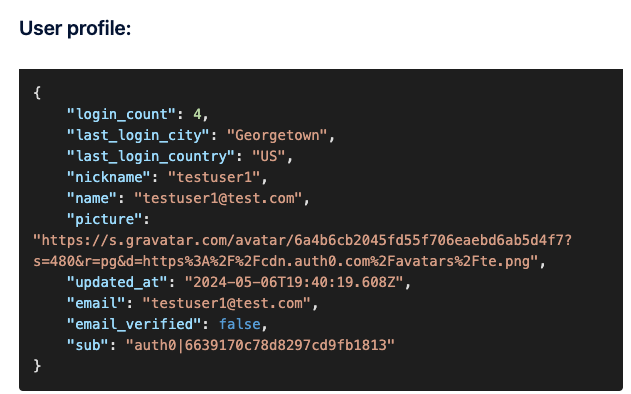

# Challenge 04: Enrich id tokens

> **Scenario**: Your app — secured by Auth0 — needs the user login city, country, and login frequency to operate.

**Your task**: Customize the user login city, country, and login frequency.

## Initial tips

- Combine your learnings of the Auth0 recap on actions and getting user context in challenge 03.
- Make sure you're sending the information on the idToken (api.idToken) and not the access token (api.accessToken)

### Solution: (expand to reveal)

Create a custom action:

1. From the Auth0 Dashboard, go to Actions > Library
1. Click Create Action > Build from Scratch.
1. Enter the following:

   - Name: post-login-claims
   - Trigger: Login/Post Login
   - Runtime: Node 18 (recommended)

1. Click Create.

1. Add the code:

   ```javascript
   exports.onExecutePostLogin = async (event, api) => {
     api.idToken.setCustomClaim("login_count", event.stats.logins_count);
     api.idToken.setCustomClaim(
       "last_login_city",
       event.request.geoip.cityName
     );
     api.idToken.setCustomClaim(
       "last_login_country",
       event.request.geoip.countryCode
     );
   };
   ```

## Deploy and test your solution

1. Click Deploy
1. On the left menu, click Actions > Flows.
1. Click Login
1. Click Custom
1. Drag and drop your action to the flow (last item).
1. Click Apply
1. Navigate to your application.
1. Click Login
1. Login
1. After login, scroll down to the user profile section and confirm that the login count, last login city and country are displayed.

   

## Congratulations

You figured how to send data to your own applications via custom claims (and you did it with zero clues). **In real life shows where custom claims are most handy. In the next **challenge, you will use Actions to trigger MFA only in specific situations.

**In real life**

The same login information relevant to third party-systems can also be critical to apps and APIs secured with Auth0. By using id token and claims, you can pass information to your apps — including geolocation, device, login frequency, and even user and app metadata — that can help provide users a better app experience. The metadata, in particular, can send important information about the user that you previously stored from other actions. Example:

```javascript
const axios = require("axios");
exports.onExecutePostLogin = async (event, api) => {
   //Send data to app via claim
   api.idToken.setCustomClaim(`stripeid`, event.user.app_metadata["stripe_cus"]);
   api.idToken.setCustomClaim(`datalakeid`, event.user.app_metadata["lakeid"]);
   api.idToken.setCustomClaim(`subscription`, event.user.app_metadata["subscription"]);
 }
};
```
