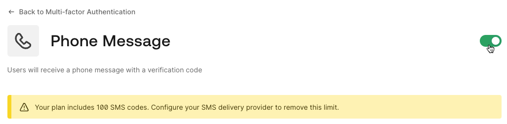
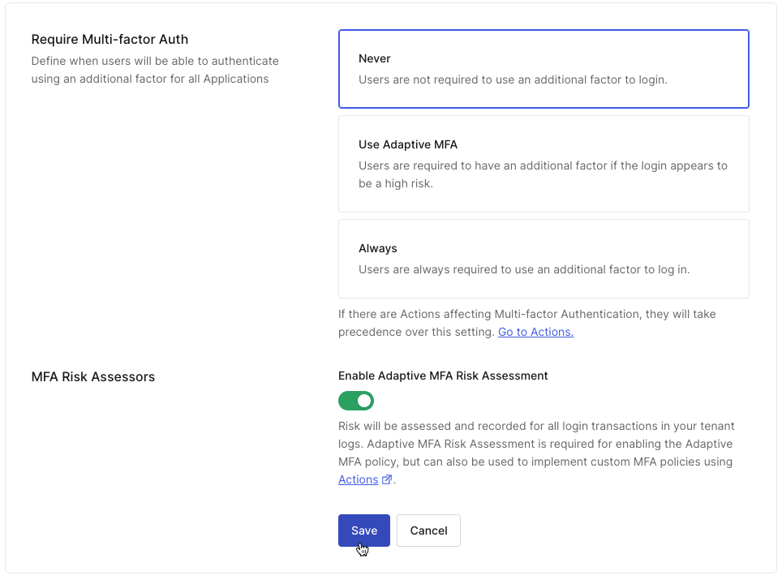

# Challenge 05: Conditional MFA (anonymizers and business hours)

> **Scenario**: Your security team discovered that 80% of account takeover attempts are happening via network anonymizers — public VPNs and tor exit nodes — or outside the user access business hours. They want to request MFA when users are on anonymizers or outside business hours, without sacrificing the end-user experience for other situations.

**Your task**: Prompt users for MFA when using anonymizers or outside business hours

## Requirement

Before we begin, we need to make sure Adaptive MFA scoring and at least MFA authenticator is enabled in your Auth0 tenant. To confirm:

1. Access the Auth0 dashboard
1. Click Security > Multi Factor Auth.
1. Under factors, ensure that at least one factor is enabled.
1. If no factor is enable, turn on Phone Message:

1. Click Phone Message.
1. Toggle the switch on the top-right corner.



1. Click <- Back to Multi Factor Authentication.

1. Scroll down to Define policies
1. Ensure that the Require Multi-factor Auth option is set to Never.
1. Turn on Enable Adaptive MFA Risk Assessment. This will allow you to implement MFA policies using Actions:



1. Click Save.

**Note:** Auth0 supports Multi-Factor Authentication in three ways:

1. [Always](https://www.google.com/url?q=https://auth0.com/docs/secure/multi-factor-authentication/enable-mfa%23enable-mfa-in-the-auth0-dashboard&sa=D&source=editors&ust=1715877455287776&usg=AOvVaw3CgJcdmPBtLAVSBsTwWPFl): Users are prompted for MFA on every login
1. [Adaptive MFA](https://www.google.com/url?q=https://auth0.com/docs/secure/multi-factor-authentication/adaptive-mfa&sa=D&source=editors&ust=1715877455288207&usg=AOvVaw128nWRJPY8dZIxIEZRbYhs): Users are prompted for MFA based on their risk scoring and other factors like impossible travel, new device, and risky ips.
1. [Customized](https://www.google.com/url?q=https://auth0.com/docs/secure/multi-factor-authentication/adaptive-mfa/customize-adaptive-mfa&sa=D&source=editors&ust=1715877455288495&usg=AOvVaw3o3DWU7TpkFR764nLg12_o): With Auth0 Actions, you can apply your own logic — [combining risk](https://www.google.com/url?q=https://auth0.com/docs/secure/multi-factor-authentication/adaptive-mfa/customize-adaptive-mfa%23riskassessment-object&sa=D&source=editors&ust=1715877455288687&usg=AOvVaw1nQJXrQWC6Bz_RvPF157Tj) with other attributes you already learned about — to determine the need for MFA.

By selecting Never and turning Enable Adaptive Risk Assessment on, you're delegating the MFA decision to your Action logic, enabling the customized experience.

## Initial tips

This example shows to how to enforce MFA from any access attempt outside the north america:

```javascript
exports.onExecutePostLogin = async (event, api) => {
 if (event.request.geoip.continentCode !== "NA")
   api.multifactor.enable("any");
};
```

### Tip 1: A boilerplate (expand to reveal):

```javascript
exports.onExecutePostLogin = async (event, api) => {
  // TODO: Make it timezone aware
 const currentHour = new Date().getHours();
 // TODO: Check if network is anonymizer
 const networkType = 'anonymizer';
 if ( networkType === 'anonymizer' || (currentHour < 9 || currentHour \> 18)){
   //TODO: prompt for mfa
   console.log("mfa");
 }else{
   console.log("no mfa");
 }
};
```

### Tip 2: Get the networkType

**Note**: The Adaptive MFA documentation provides full documentation about all the conditions evaluated by Auth0 and available in your action, including the [categories of network it can identify](https://www.google.com/url?q=https://auth0.com/docs/secure/multi-factor-authentication/adaptive-mfa/customize-adaptive-mfa%23category-property&sa=D&source=editors&ust=1715877455295270&usg=AOvVaw1-QZ3_2yiPsLiE5H1XLalL) (such as anonymizers, bots, data centers, and others).

```javascript
const networkType = event.authentication.riskAssessment.assessments.UntrustedIP?.details?.category;

if ( networkType === 'anonymizer' || (currentHour < 9 || currentHour \> 18)){

}
```

### Tip 3: How to make my code timezone aware?

```javascript
 const currentHour = parseInt(
   new Date().toLocaleTimeString(
     "en-GB",
     {
       timeZone: event.request.geoip.time_zone,
       hour: "2-digit"
     }
   )
 );
```

**Tip**: This code:
* Instantiates a new date object (with the current time)
* Leverages toLocaleTimeString to convert the timezone, get just the hours, in a 24 hour format (the standard in "en-GB"):
* This technique is used to convert and extract hours using the current javascript capabilities ([covered in Mozilla's JavaScript documentation](https://www.google.com/url?q=https://developer.mozilla.org/en-US/docs/Web/JavaScript/Reference/Global_Objects/Date&sa=D&source=editors&ust=1715877455300658&usg=AOvVaw01R8yQ6WW3YqLc2A_GSKmx)) without requiring extra libraries.
* Currently (Apr-2024), the TC39 (Technical Committee 39) group — the ECMAScript group that defines JavaScript — is working on [Temporal](https://www.google.com/url?q=https://tc39.es/proposal-temporal/docs/index.html&sa=D&source=editors&ust=1715877455301079&usg=AOvVaw3QYvtzxXPVbNNnFi9lPyVy), a global object in javascript to better handle dates in the language.
* Converts the result to a int (so it can be executed by our if statement later)

### Tip 3: How to get the user timezone from the request?

```javascript
console.log(event.request.geoip.timeZone);
```

### Tip 4: How to unit test your Action before deploy (expand to reveal):

1. On the left menu, click the test functionality (play icon);
1. Click Run. You should get a successful run (no errors reported).

### Solution: (expand to reveal)

Create a custom action:

1. From the Auth0 Dashboard, go to Actions > Library
1. Click Create Action > Build from Scratch.
1. Enter the following:
    - Name: post-login-conditional-mfa
    - Trigger: Login / Post Login
    - Runtime: Node 18 (recommended)
1. Click Create.

Add the code:

```javascript
exports.onExecutePostLogin = async (event, api) => {
 const currentHour = parseInt(
   new Date().toLocaleTimeString(
     "en-GB",
     {
       timeZone: event.request.geoip.timeZone,
       hour: "2-digit"
     }
   )
 );

 const networkType = event.authentication.riskAssessment.assessments.UntrustedIP?.details?.category;
 console.log(`networkType: ${networkType}`);
 console.log(`currentHour: ${currentHour} timezone: ${event.request.geoip.timeZone}`);

 if ( networkType === 'anonymizer' || (currentHour < 9 || currentHour \> 18)){
   console.log("mfa");
   api.multifactor.enable('any', { allowRememberBrowser: false });
 }else{
   console.log("no mfa");
 }
};
```

1. On the left menu, click the test functionality (play icon);
1. Click Run. Monitor the logs to see the outcome and change the if statement to test the MFA in different times.
1. After tests, remove the console.log lines.

> **IMPORTANT**: If you want to test the MFA condition right now, also consider changing the MFA requirement during business hours (`currentHour > 9 && currentHour < 18`) so the MFA will be triggered during the lab.

```javascript
exports.onExecutePostLogin = async (event, api) => {
 const currentHour = parseInt(
   new Date().toLocaleTimeString(
     "en-GB",
     {
       timeZone: event.request.geoip.timeZone,
       hour: "2-digit"
     }
   )
 );

 const networkType = event.authentication.riskAssessment.assessments.UntrustedIP?.details?.category;

 if ( networkType === 'anonymizer' || (currentHour \> 9 && currentHour < 18)){
   console.log("mfa");
   api.multifactor.enable('any', { allowRememberBrowser: false });
 }else{
   console.log("no mfa");
 }
};
```

## Deploy and test your solution

1. Click Deploy
1. On the left menu, click Actions > Flows.
1. Click Post Login
1. Click Custom
1. Drag and drop your action to the flow.
1. Click Apply
1. Navigate to your application.
1. Log out of your existing session.
1. Click Login
1. Login
1. You will be prompted for an MFA sign-up and then for MFA prompts depending on your timezone, network, and MFA state.
1. Complete the MFA prompt.
1. (optional) If you changed the MFA business hours for tests, return to your ​​action code and revert the change (to avoid the MFA prompt friction as you complete the challenge on business hours). Don't forget to Deploy your update:

```javascript
exports.onExecutePostLogin = async (event, api) => {
 const currentHour = parseInt(
   new Date().toLocaleTimeString(
     "en-GB",
     {
       timeZone: event.request.geoip.timeZone,
       hour: "2-digit"
     }
   )
 );

 const networkType = event.authentication.riskAssessment.assessments.UntrustedIP?.details?.category;

 if ( networkType === 'anonymizer' || (currentHour < 9 || currentHour \> 18)){
   console.log("mfa");
   api.multifactor.enable('any', { allowRememberBrowser: false });
 }else{
   console.log("no mfa");
 }
};
```

## Congratulations

You made MFA conditional and learned a way to introduce security without extra friction. You also learned about the current state of Date in Javascript and the exciting future with Temporal. **In real life shows other cases you can apply MFA without introducing user **friction. In the next and final challenge, you will use actions to prompt users for information.

**In real life**

Displaying MFA only when necessary is a critical requirement for securing your customer-facing apps without adding friction to users (and impacting your business). For that, you can use actions to:

* Triggering MFA only on specific conditions (like time of the day) or a combination of multiple conditions (i.e. new IP, country, and outside business hours).
* Trigger MFA only when users access specific parts of your applications and APIs (aka: [Step-up Auth or Step-up MFA](https://www.google.com/url?q=https://auth0.com/docs/secure/multi-factor-authentication/step-up-authentication&sa=D&source=editors&ust=1715877455331995&usg=AOvVaw1CV3DjtVlw1MJYTOflNGYs))
* Trigger MFA only when the app request access to sensitive information from the user profile (based on request scopes and claims)
