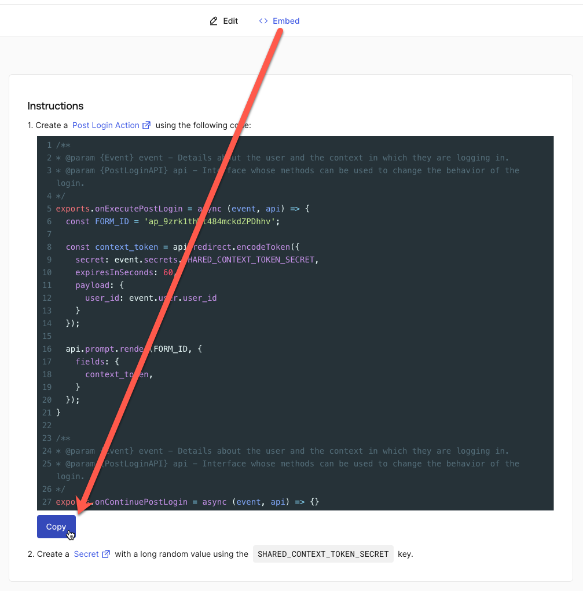
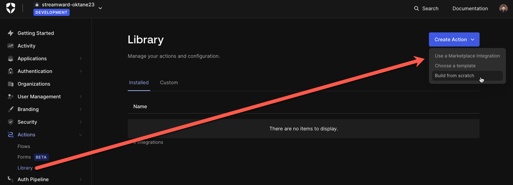

# Challenge 06: Prompt users to accept privacy policy updates

> **Scenario**: Your organization recently updated the privacy policy for using your software. Because the change is considered material — according to GDPR and CCPA terms, you are required to prompt all users on login to understand and explicitly accept the new terms.

**Your task**: Embed a form in your login process (using forms for action) to prompt users to recognize and accept your updated privacy policy.

## Integrate Auth0 and Forms for action

**Note:** Forms for action is an independent module in the Okta platform. It lets you add custom logic that requires user input — inc. front-end, routing, and conditional logic — into Auth0 actions and flows. As an independent module, Forms for action requires a secure connection — using a M2M token and a shared JWT secret — with your Auth0 tenant to work. The M2M token establishes security when Forms for action makes API calls to Auth0. The JWT secret works the opposite way, securing communications starting from Auth0 to Forms for actions.

Create a M2M token in Auth0:

1. From the Auth0 dashboard, click Applications > Applications.
1. Click Create Application.
1. Enter the following and click Create.
   - Name: FormsAction
   - Application type: Machine to Machine Applications
1. Select the Auth0 Management API.
1. Select the following permissions (use filter permissions to narrow down the options):

   - read:users
   - update:users
   - create:users
   - read:users_app_metadata
   - create:users_app_metadata
   - update:users_app_metadata
   - delete:users_app_metadata

1. Click Authorize.
   
1. Click Settings.
1. Record the domain, client id, and client secret (this data is used by Forms for Action to communicate with your Auth0 tenant):

   

Connect Forms for action and Auth0:

1. From the Auth0 dashboard, click Actions > Forms.
   A new screen with the Forms for action dashboard is displayed. This is where you can set up Forms that require user input.
1. From the header, expand the menu and then click Vault.
   
1. Click Add Connection.
1. Choose Auth0 and click Continue.
1. Enter Auth0 as the connection name and click Continue.
1. Paste the tenant domain, client id, and client secret, obtained in the previous steps.
   
1. Click Continue.
1. You should see your connection under the vault:  
   

Create a shared JWT secret:

1. From the Vault screen, click Add Connection.
1. Select JWT and click Continue.
1. Enter JWT as the connection name and click Continue.
1. Enter a Secret (IMPORTANT: record this value for later use) and click Continue.
1. You should see both the JWT and the Auth0 connection under the vault.

   

## Create a privacy policy form

1. Click Forms (located on the header).
1. Click Create Form
1. Click Use a template
1. Celect Custom policies acceptance.
1. Enter the following information:

   - Form name: policy_Custom policies
   - Flow 1 name: policy_Get user
   - Flow 2 name: policy_Update user_metadata

1. Click Continue.
1. For the connection, select your existing Auth0 and JWT connections and click Create.
   
1. You will be redirected to the form editor:  
   

Your form template is ready for customization. Now, let's:

- Customize the policy message.
- Future proof your privacy policy with logic to track which policy version a user accepted.

## Customize the privacy policy message

1. Click on the New policies update form to open the Rich text editor.
1. Paste the policy content as follows:

   ```
   Please read and accept the terms and policies, {{ state.user.name }}

   New version: v{{state.policy_version}}.
   Your version: v{{state.user.app_metadata.privacy_policy_version}}.

   When you visit our websites, our system automatically logs your Internet Protocol (IP) and device used (via device headers). We process your IP and device, alongside previous login activity to identify anomalous activity and block logins of high risk.
   ```

   

1. Click Publish (top-right hand corner) to save your changes.

## Future proof your privacy policy

Our privacy policy will implement versioning to ensure users are prompted whenever a significant update to your privacy policy happens, future proofing your app for privacy updates.

To do this, we need to modify our form routing flow and routing to set the current policy version, check if the user accepted the current policy, and store that the user accepted the policy in Auth0.

Create a flow to set the current Policy Version:

1. Click Flow at the bottom of the page
1. On the new Flow component, click on Click to add a flow.
   
1. On the right-hand side, enter policy_Set Version as the Alias.
1. Under the flow section, click Create New Flow.

   

1. Enter policy_Set Version as the flow name and click Create.
1. Click Publish.
1. Click Edit Flow.
1. A new tab with the visual flow editor opens up.

   

   The visual flow editor lets you add business logic to your flow.

1. Click the plus sign.

   The right-hand will display a list of actions you can take.

1. Under the Logic section, select Store state variable.

   A store state variable is added to your flow.

1. On the right-hand side panel, under Data fields, click inside the text box (left side) and enter:


    - Variable name: policy_version
    - Value: 2.0

1. Click Save.
1. Click Publish.
1. Note that besides the first text box, you have a copy expression icon.
   
1. Copy that expression value and confirm that the value matches the rich text from your privacy policy message: {{state.policy_version}}  
   
1. Close the current tab on your browser with the flow editor and go back to the Forms visual editor.
   The flow is not connected to your logic yet.
1. Connect the policy_Set Version after Get User and before the Router:

1. Click the connection line between the Get User flow and the Router.
1. Click Delete Link (trash bin icon).
   
1. When prompted, confirm the deletion.
1. Click on the yellow circle to the right of Get user and drag it to the left of policy_Set Version.
1. Repeat the same step to connect policy_Set Version to the router.
1. Now, the set policy_Set Version is executed after Get user and sets the policy version before the router is executed.
1. Click Publish.

Update the Router to verify if the user accepted the latest privacy policy version:

1. Click on the Router component
2. On the right-hand side, click Missing Policies.
3. Replace the existing expression with the following:

   

   ```
   {{state.user.app_metadata.privacy_policy_version}}

   "Is different to"

   {{ state.policy_version }}
   ```

4. Now, your router is checking the privacy_policies_version value coming from the user from Auth0 — value acquired by the Get User step — with the policy_version variable you previously defined.
5. Click Save
6. Click Publish

Now, the router validates if the user accepted the latest policy_version. If yes, the user goes to Resume authentication and is not prompted to accept the privacy policy update. Next, we need to modify the flow that updates the user metadata with the policy version accepted (after the user agrees to the policy update and click the Continue button).

Store that the user accepted the policy in Auth0:

1. Click the policy_Update user_metadata flow.
1. On the right-hand side, click Edit Flow.

   The Visual Flow editor is displayed in a new window.

1. Click the Update user task.

   The right-hand side panel displays how Forms for Action updates Auth0 — including connection, user id, and body — after a user accepts the new policy. Let's update the request body:

1. Update the request body with the following:

```json
{
  "app_metadata": {
    "privacy_policy_version": "{{ state.policy_version }}",
    "privacy_policy_timestamp": "{{ toTimestamp() }}"
  }
}
```

1. The body payload (in json format) is updating the user app_metadata in Auth0 with the policy version accepted by the user alongside the timestamp of the operation.
   
1. Click Save and Publish.

Your form is ready to be integrated into your login process. Now we need to embed it in the login via actions.

## Embed form in your login via Auth0 Actions

1. Return to the forms editor.


1. Click Embed (top-center) and copy the actions code:



1. Return to the Auth0 dashboard. Click Actions > Library, and then click Create Action > Build from scratch:  
   
1. Create an action as follows:

   - Name: policy_form
   - Trigger: Login / Post Login
   - Runtime: Node 18 (Recommended)

1. Paste the code copied from the forms editor in the first step.
1. Click Secrets. Create a secret as follows:

   - Key: SHARED_CONTEXT_TOKEN_SECRET
   - Value: <paste the value you defined for the JWT connection>.

1. Click Deploy.
1. Click Add to flow.
1. Add the policy_form as the first step in your post login flow, and click Apply.

## Test

1. Return to and sign out of your test app.
1. Log in with your test user. You will be prompted to accept the new privacy policy:

   

1. To continue, agree to the policy and click Continue.
1. You will be redirected to your application.
1. To confirm that the integration worked:

1. Return to your Auth0 dashboard.
1. Click User Management > Users, and then click your test User.
1. Under the app metadata, you should see the privacy policy version and timestamp:  
   

1. Log in again. Since you're on the latest policy, you shouldn't be prompted to accept the policy anymore.

## Congratulations

You prompted users to accept a privacy policy update, a common requirement on privacy laws like CCPA and GDPR. You also learned a good practice on how to keep better track of privacy with versioning. In our optional/extra challenge, you continue using forms for action with a surprise lab: integrate billing and subscription with Stripe.
