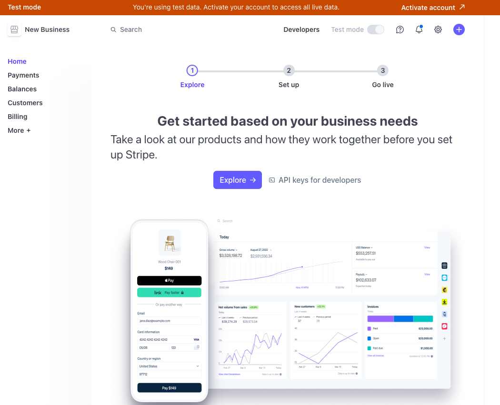
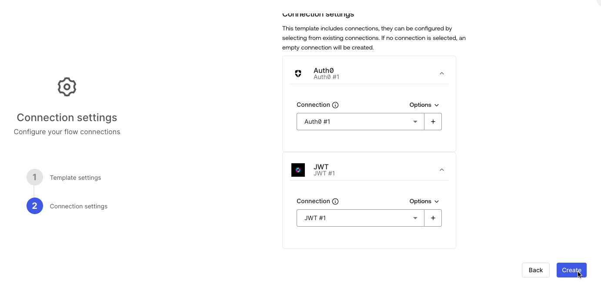
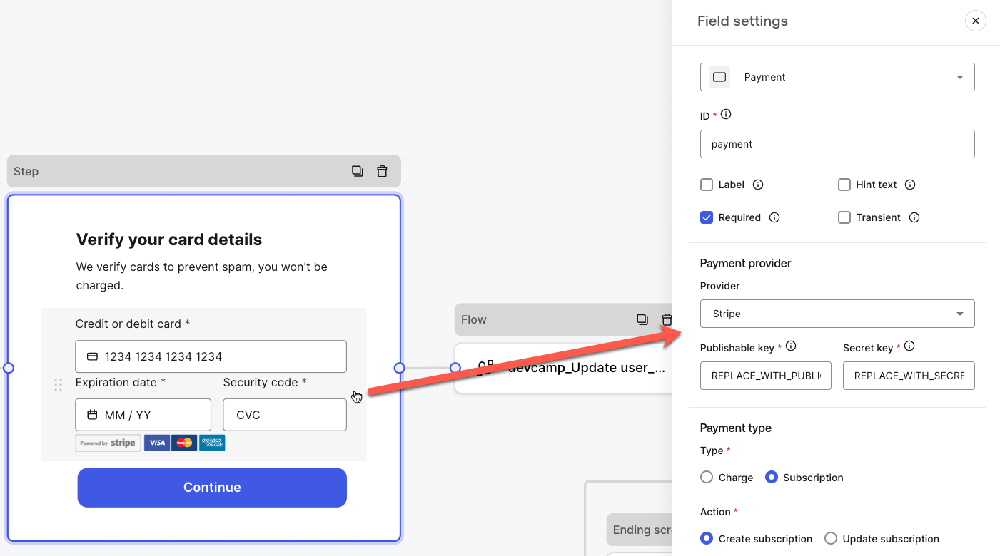

# Challenge 07: Integrate billing and subscription with Stripe

> **Scenario**: Your app is ready for the big stage! The only thing left to do is to charge users. For this, your company wants to use Stripe for billing and subscriptions.

**Your task**: Integrate Stripe and Auth0 using Forms for Action.

## Requirement

For this lab, you will need a Stripe account. Stripe offers a free account for developers. To grab yours:

1. Go to [https://dashboard.stripe.com/register](https://www.google.com/url?q=https://dashboard.stripe.com/register&sa=D&source=editors&ust=1715877455354013&usg=AOvVaw2Jvr7suXyz9-BLM18OHL2X)
1. Follow the instructions provided by Stripe to create an account and verify your email.
1. (if prompted to activate payments — screen below) Ignore this step by clicking Explore more features.
   
1. (If Stripe prompts for an onboard survey) click Skip and activate your account (top-right corner).
1. (If the Activate Payments screen appears) click X (top-left corner)
1. You should see a landing page like the following:  
   

## Create a premium subscription plan

1. Access the Stripe Dashboard: [https://dashboard.stripe.com/test/dashboard](https://www.google.com/url?q=https://dashboard.stripe.com/test/dashboard&sa=D&source=editors&ust=1715877455354971&usg=AOvVaw2N1qWTpQ_d8am6j6KpiJHB)
1. Click More + > Product catalog
1. Click + Add product
1. Create a product with the following data:

   - Name: Premium
   - Description: All the best we have to offer
   - Recurring: Selected
   - Amount: $ 10.00
   - Billing period: Monthly

1. You will be redirected back to the product catalog page.
1. Click the product you've just created.
1. Under the Pricing section, record the pricing id (it starts with price_). You will need this information in Auth0 to work with Stripe  
   

## Create a payment prompt form in Auth0

1. Access your Auth0 dashboard
1. Click Actions > Forms
1. On the forms dashboard, click Create Form.
1. Click Use a template and then select Payment details with Stripe.
1. Enter the following information:

   - Form name: devcamp_Payment with Stripe
   - Flow 1 name: devcamp_Update user_metadata
   - Flow 2 name: devcamp_Get user

1. Click Continue.
1. For the connection, select your existing Auth0 and JWT connections and click Create.
   
1. You will be redirected to the form editor:  
   
1. From the form editor, click the stripe form input. A form settings will be displayed on the right hand side:  
   
1. On the form, update the publishable key: and the secret key with the values from Stripe (available on the Stripe dashboard, under Developers > API keys)  
   
1. Under recurring prices, paste the pricing id from your premium plan (available on the stripe dashboard under More + > Product catalog):  
   
1. Click the form text (before credit card input form):

1. Change the form copy as follows:

   ```
   Verify your card details

   Hi {{state.user.given_name}}. Before we continue, we need to verify your credit card to prevent spam. You won't be charged.
   ```

1. On the Auth0 form page, click Publish (top-right hand corner)

   

Your form is ready to be integrated into your login process. Now we need to embed it in the login via actions.

## Embed form in your login via Auth0 Actions

1. From the forms editor, click Embed (top-center) and copy the actions code:


1. Return to the Auth0 dashboard. Click Actions > Library, and then click Create Action > Build from scratch:  
   
1. Create an action as follows:

   - Name: stripe_form
   - Trigger: Login / Post Login
   - Runtime: Node 18 (Recommended)

1. Paste the code copied from the forms editor in the first step.
1. Click Secrets. Create a secret as follows:

   - Key: SHARED_CONTEXT_TOKEN_SECRET
   - Value: Use the JWT secret value you set when creating the JWT connection in Challenge ##.

1. Click Deploy.
1. Click Add to flow.
1. Add the stripe_form as the first step in your post login flow, and click Apply.

   

## Test

1. Access your test application.
1. Log in with an existing user. You will be prompted to enter your credit card information:  
   
1. To continue, you can enter one of the [test payment credit cards provided by Stripe](https://www.google.com/url?q=https://docs.stripe.com/testing&sa=D&source=editors&ust=1715877455361249&usg=AOvVaw2UdRQZbfbwmG7AW39hAbC6):

   - Credit card number: 4242 4242 4242 4242
   - Expiration date: 12 / 29
   - CVC: 123

1. Click Continue.
1. You will be redirected to your application.
1. To confirm the integration worked in Stripe:

1. Access your Stripe dashboard ([https://dashboard.stripe.com/test/dashboard](https://www.google.com/url?q=https://dashboard.stripe.com/test/dashboard&sa=D&source=editors&ust=1715877455362303&usg=AOvVaw3ylGib3QWzM10UtIEWwamW)).
1. Click Customers. You should see a new customer entry matching your user email.
1. Click the customer record.
1. You should see:  
   

   - Subscriptions: a Premium trial expiring in 15 days
   - Payment methods: a test credit card registered
   - Invoices: A $0 invoice registered for the trial.

1. To confirm that the integration worked in Auth0:

1. Return to your Auth0 dashboard.
1. Click User Management > Users, and then click your User.
1. Under the user metadata, you should see a payment_method id. (this matches the Stripe payment method id for the user in Stripe)  
   

## Congratulations

You completed all the action challenges, including Stripe!

**In real life**: Many apps collect credit card information during the sign-up and login process to confirm the user intent to buy. This is a common use-case in streaming services like Netflix and Disney+ and in SaaS services with a individual plan, and in apps with reverse trial pricing.
