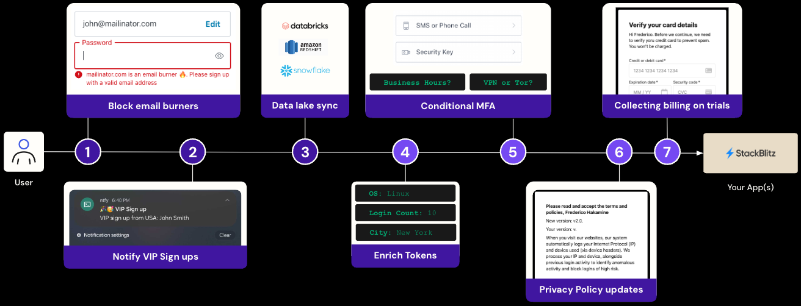

## Welcome to the Actions Challenge!

In the previous labs, you learned how to secure your Apps and APIs with Auth0 end-to-end: from sign-ups, to authentication, to MFA, and API authorization using our SDK and out-of-the-box features.

While this serves the majority of use-cases, production-graded apps can present unique challenges that require customizing how sign-ups, login, and MFA prompts are handled. Auth0 Actions lets you customize these processes anyway you want using NodeJS.

In the actions challenge, you explore seven of the most popular use-cases that lead Auth0 developers to use Actions:

1. **Prevent fraudulent sign-ups**: Your team is seeing a high volume of free sign-ups using email burner domains (like @mailinator.com). Build an action to block fraudulent sign-ups using the list of [burner email providers](https://www.google.com/url?q=https://github.com/wesbos/burner-email-providers&sa=D&source=editors&ust=1715877455179466&usg=AOvVaw1O7fMxvSNBzmYhILAlWjK9) (actively maintained by Wes Bos ❤️).
1. **Notify VIP sign-ups**: Your sales team wants to be notified of VIP sign-ups. Build an action to send a notification whenever an important prospect signs up to your app.
1. **Sync Auth0 and a data lake via REST API**: Your data science team wants to receive information about users' logins in their data lake for trend analysis. Build an action to send auth info, alongside geo location, login frequency, and other trends whenever a user logs in.
1. **Enrich id tokens**: Your app — secured by Auth0 — needs the user login city, country, and login frequency to operate. Use your previous learnings to send this data via id token.
1. **Conditional MFA**: Your security team wants to enforce MFA when users are on public VPNs, tor networks, or outside business hours. Build an action to prompt users for MFA on these conditions.
1. **Privacy policy updates**: Your company recently updated the privacy policy. To stay GDPR compliant, you must prompt users at login to understand and accept the new terms. Build an action to prompt users to and accept the updated policy.
1. **Integrate billing and subscription with Stripe**: Your company wants to run a reverse trial in your app (premium free for 7 days), using Stripe for billing and subscriptions. For that, you must collect billing information upon the first login or sign-up.

While your app likely doesn't need all these actions, you can take the challenge as a way to test your NodeJS skills and shop for ideas to make your app identity even better over time.

**Note:** After each challenge, explore the "**In real life**" section to understand the business **scenarios and types of apps that will typically leverage the action you built.
